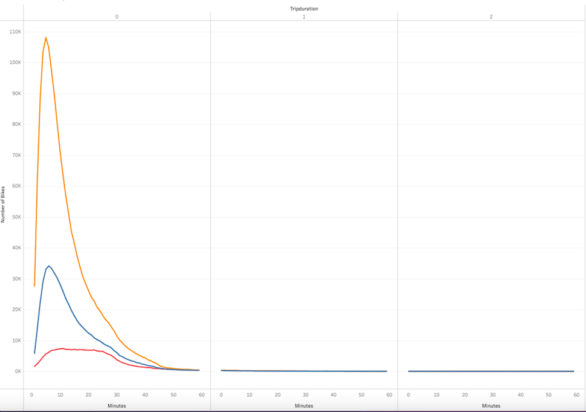

# Bikesharing

## Overview of the analysis

The purpose of this project is to show potential angel investors how the bike-sharing model works in New York City in order to provide seed funding to explore bike-sharing program in Des Moines.

## Tableau Public Link

[Bike Challenge Link to Dashboard](https://public.tableau.com/app/profile/keerti7577/viz/bikesharing_challenge_16636319384400/NYCCityBikeData?publish=yes)

## Results

In this visualization, it shows the length of time that bikes are checked out for each gender. The majority of users check out between the first twenty minutes.

This plot shows the number of bike trips by weekday for each hour of the day as a heatmap.

This shows the number of bike trips by gender for each hour of each day of the week as a heatmap. Males are the majority of the users.

In this plot of heatmap, it shows the number of bike trips broken down by gender for each day of the week by each Usertype. Most of the users are subscribers and they use it during weekdays.

This plot shows the peak hours for bike trips during the month of August. Highest acitvity hours are from 5 P.M. to 7 P.M.

This plot shows the most popular stations in the city for starting a bike journey. Size of the symbols determine the most popular locations and color help us differentiate between the most popular locations and less popular locations.

Similarly, this plot shows the most popular stations in the city for ending a bike journey. The size of the symbols corresponds to the popularity of a given location. Color of the symbols represent the most popular ending locations.

## Summary

The data shows that the bike sharing service in New York city was high during the month of August 2019. A peak number of riders rented a bike for 5 to 6 hours and the far majority of the rides were taken by male users during morning and evening rush hours. This implies that Citi Bike services are used as an alternative to public transportation by commuting workers.
Two Additional analysis that would be beneficial are :

- Comparing data for different months to determine trends across the year.
- Average distance between customers home location and the bike renting location.
